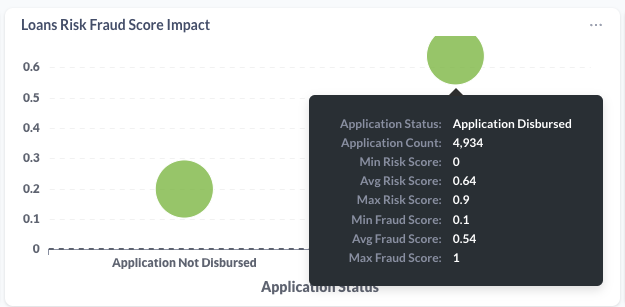
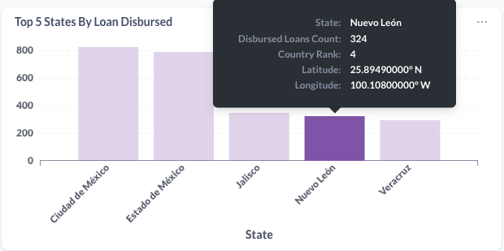
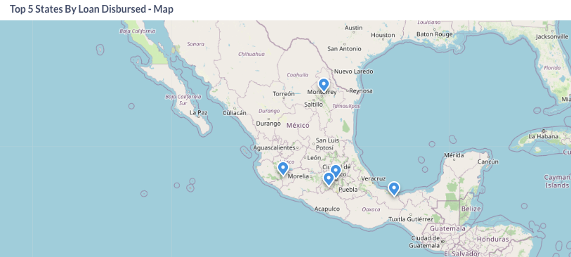
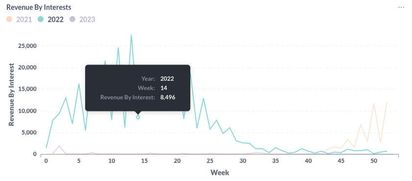
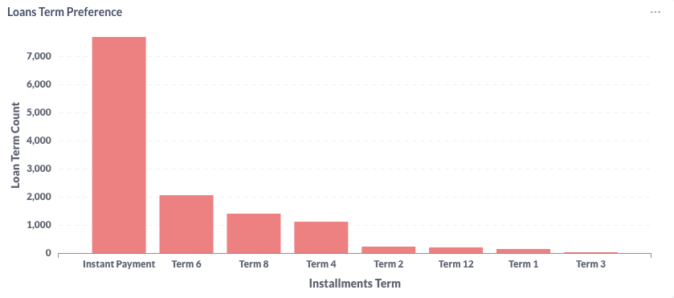
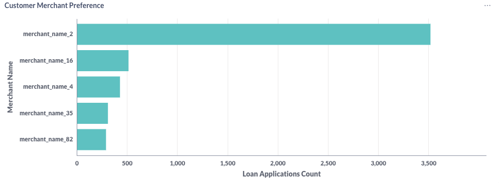
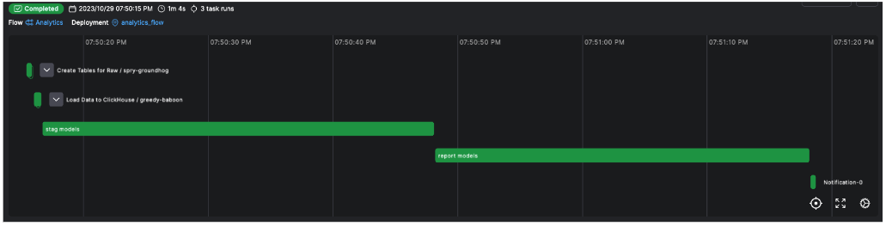
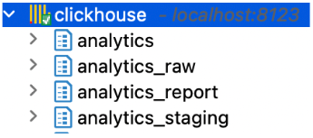
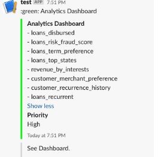

# Analytics Project - Loans and Customer Zoom-in

This project aims to have a E2E pipeline to process/transform raw data about
loans, customers and repayments and extract useful insights from them.


The Tech Stack to solve this use case is:
- [ClickHouse - an open-source database analytics](https://clickhouse.com/)
- [dbt - a SQL-first transformation workflow ](https://www.getdbt.com/)
- [Prefect - a Modern workflow orchestration](https://www.prefect.io/)
- [Metabase - analytics dashboards](https://www.metabase.com/)
- Slack - for notifications

***

## Prerequisites 
- pyenv installed on your computer, [more info here](https://github.com/pyenv/pyenv).
- Slack account and app for setting incomming webhooks up, [more info here](https://slack.com/)
- Java Corretto 11+, [more info here](https://docs.aws.amazon.com/corretto/latest/corretto-21-ug/downloads-list.html)

***

## Install python dependencies

Before you install dependencies, let's insolate our environment using **pyenv**

Create a virtual environment
```bash
pyenv virtualenv 3.9 analytics_env
```

Activate our virtual environment
```bash
pyenv activate analytics_env
```


- To load information into our DWH ( ClickHouse ), we will need **clickhouse-connect**
- To run transformations over our raw data and generate docs, we will need **dbt-clickhouse**
- To generate ERD for our data modelling, we need **eralchemy**
- To orchestrate our data pipeline, we need **prefect**

All python libraries needed can be found on **./requirements.txt** file.


Install Python dependencies
```bash
pip install -r <dir-path>/requirements.txt
```

## Run servers

### Orchestration 

Running on **http://127.0.0.1:4200**

```bash
prefect start server
```

To deploy our data flow
```bash
prefect deployment run 'Analytics/analytics_flow'
```

### DWH 

Running on **localhost:8123***
```bash
clickhouse server
```

### Documentation

Running on **http://localhost:8001**

```bash
dbt docs serve --port 8001
```

Visualization

Important to see this to connect Metabase with ClickHouse, [more info here](https://github.com/ClickHouse/metabase-clickhouse-driver#choosing-the-right-version)

Running on **http://localhost:3000/**

```bash
MB_PLUGINS_DIR=./plugins; java -jar metabase.jar
```

******

## DBT

**DBT** allows us to transform data using SQL. It can be integrated in a CI/CD pipeline and it creates documentation about models.

Data Quality is set using the **schema.yml**. You can set foreach column its tests 
to be validated. For example the id column must be **unique** and **not_null**.

DBT has generic tests (unique, not_null, accepted_values, relationships) which you can use but if you need more expecific rules
you can take a look at
- [dbt_expectations](https://github.com/calogica/dbt-expectations)
- [soda](https://docs.soda.io/)

Commands:
- dbt run --select %my model name%
- dbt test --select %my model name%
- dbt docs generate

Data Lineage


***

## Insights

You can create your own graphs taking advantage of **Metabase**

```
http://localhost:3000/
```


Disbursed Loans


Risk and Fraud Score Impact



Loans by State



Loans by State Map



Revenuew by Interests



Customer Term Preference



Customer Merchant Preference




## Orchestration and Notification

The pipeline is made of four steps:
- Creation tables on ClickHous
- Load CSV files into **raw schema**
- Creation of Dim and Fact tables on **stag schema**
- Transform fact and dim tables into insights on **report schema**







A report of the updated tables is sent to an Slack Channel.


